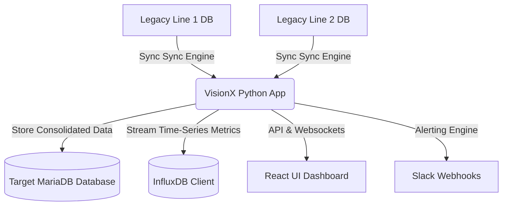

# VisionX - System Usage and Architecture Guide

Welcome to the usage and technical reference document for **VisionX (Lawrence Vision Sync Engine)**. This file is structured to help you understand how the system works, the database models it relies on, the core synchronization logic, and how to set up, operate, and troubleshoot the pipeline.

---

## 1. System Architecture Overview

VisionX operates as a bridge between legacy production line inspection computers (running older Windows XP operating systems and local MySQL/MariaDB databases) and a modern centralized data repository. 



### Core Components
1. **Sync Engine (`app/sync_engine.py`)**: Runs on a periodic background scheduler (every minute) to concurrently fetch inspection data from all configured legacy databases and ingest it into the target database and InfluxDB.
2. **Alert System (`app/alert_system.py`)**: Runs every 30 minutes to calculate rolling averages of inspections against product specifications, logging errors and pushing notifications to Slack in case of limit violations.
3. **Web API (`app/main.py`)**: A FastAPI web server that manages the schedulers, handles ping status checks, hosts configuration endpoints (like Slack settings), and serves status info to the user interface.
4. **User Interface (`ui/`)**: A modern React-based monitoring dashboard displaying real-time synchronization statistics, line status, and configurations.

---

## 2. Database Schema (Target DB)

VisionX consolidates incoming data into a structured MariaDB/MySQL database. Below is the list of tables defined in [init.sql](file:///home/master/visionx/init.sql):

### 1. `vision_runs`
Tracks metadata and aggregated statistics for each production run per line.
*   **Primary Key**: `(SourceLine, RunId)`
*   **Key Fields**:
    *   `StartTime` & `EndTime`: Timestamp of the run start and completion.
    *   `ProductId`: The identifier of the product being inspected.
    *   `nDetected`, `nPassed`, `nMarginal`, `nRejected`: Counter metrics for item classification.
    *   `WidthAverage`, `HeightAverage`, `DMajorAverage`, `DMinorAverage`, `DAvgAverage`: Measurement averages for the run.
    *   `SyncUp` & `LastUpdate`: Internal sync management timestamps.

### 2. `vision_lanes`
Breaks down the run statistics per individual inspection lane.
*   **Primary Key**: `(SourceLine, RunId, LaneId)`
*   **Key Fields**: Identical metric fields to `vision_runs` but scoped to individual lanes (`LaneId` like 'A', 'B', etc.).

### 3. `vision_samples`
Granular time-series snapshot samples recorded throughout each run. Used to analyze short-term drift and specs violations.
*   **Primary Key**: `(SourceLine, RunId, LaneId, SampNo)`
*   **Key Fields**:
    *   `SampTime`: Normalized timestamp of when the sample was recorded.
    *   Aggregated measurement snapshots (`WidthAverage`, `HeightAverage`, `DAvgAverage`, `ToastAverage`, etc.) taken for sample index `SampNo`.

### 4. `vision_product`
Holds product specifications and specification limits.
*   **Primary Key**: `(SourceLine, ProductId)`
*   **Key Fields**:
    *   `D1Min`, `D1Target`, `D1Max`: Target boundaries for outer dimension 1 (e.g., major diameter).
    *   `D2Min`, `D2Target`, `D2Max`: Target boundaries for outer dimension 2 (e.g., minor diameter if elliptic).
    *   `EFMax`, `EDMax`, `HAMax`: Tolerable defect limits for edges and hole areas.
    *   `ToastMin`, `RawMax`, `TransMax`: Coloration threshold settings (toast, raw, translucency).

### 5. `vision_alert_history`
Maintains a record of all triggered parameter-compliance alerts.
*   **Primary Key**: `(id)` (Auto-increment)
*   **Key Fields**: `SourceLine`, `AlertTime`, `RunId`, `ProductId`, `Details` (error message summary), and `SlackSentTime` (when successfully dispatched to Slack).

### 6. `vision_slack_settings`
Stores Slack webhook connection details.
*   **Primary Key**: `(id)` (Single record, ID = 1)
*   **Key Fields**: `webhook_url`, `mention_target` (e.g., `@here`, `U12345678`), and `is_enabled` (boolean toggle).

---

## 3. Core Mechanisms & Methods

### A. Synchronization Logic & Time Normalization
Since legacy source databases are often running on outdated operating systems, their system times can drift significantly. The synchronization uses a robust alignment method defined in `get_corrected_datetime()`:

*   **Legacy Systems (`override_time` config flag is active)**:
    *   The sync engine ignores the source system's calendar date entirely, mapping records onto the **Host Local Date**.
    *   It checks the time drift (HH:MM:SS) between source and host. If it's **less than 10 minutes**, it preserves the source's time part. If it exceeds 10 minutes, it overrides it completely with the **Host Current Time**.
*   **Newer Systems**:
    *   Trusts the source's calendar date, but checks full datetime drift. If drift is **greater than 10 minutes**, it overrides the hour/minute/second with the **Host Time** while keeping the source's date. Otherwise, it trusts the source's datetime completely.

### B. Speclimit Checking and Alerting Engine
Every 30 minutes, `run_alert_check()` evaluates active runs:
1.  Filters for active runs (`EndTime IS NULL`) that have received updates in the last 30 minutes and have been running for at least 30 minutes.
2.  Fetches the 30-minute average of `vision_samples` for the active run.
3.  Compares averages to limits in `vision_product`:
    *   **DAvgLast Check**: Alerts if the latest average diameter `DAvgLast` drops below `TargetDMinorMin` or exceeds `TargetDMajorMax`.
    *   **Ratio Check**: Alerts if the aspect ratio (`DMinor / DMajor`) falls outside the expected tolerance ratio.
4.  If a violation is found:
    *   Records details in `vision_alert_history`.
    *   Dispatches a formatted Markdown notification payload to the configured Slack Webhook.

---

## 4. Installation and Setup

### Docker Infrastructure Setup (Recommended)
1.  **Configure environment**:
    ```bash
    chmod +x deploy.sh
    ./deploy.sh
    ```
    Choose option `1) Configure` to specify your database connections, InfluxDB tokens, and overrides.
2.  **Initialize Target Tables**:
    Run option `5) Create Tables (Target DB)` in `./deploy.sh`. This runs `init.sql` to initialize the database tables.
3.  **Start Services**:
    Choose option `2) Launch` from the menu. This spins up the Docker containers in detached mode.

### Local Development Setup

#### Backend (Python/FastAPI)
1.  Navigate to the project root and activate virtual environment:
    ```bash
    source venv/bin/activate
    ```
2.  Install packages:
    ```bash
    pip install -r app/requirements.txt
    ```
3.  Set up your local `.env` file (copied from `.env.sample`).
4.  Start the FastAPI application:
    ```bash
    uvicorn app.main:app --host 0.0.0.0 --port 8000 --reload
    ```

#### Frontend (React/Vite)
1.  Navigate to the UI folder:
    ```bash
    cd ui
    ```
2.  Install package dependencies:
    ```bash
    npm install
    ```
3.  Start development server:
    ```bash
    npm run dev
    ```

---

## 5. Usage & Operations

### Monitoring via Dashboard
Access the React UI (default port: `http://localhost:3000` or whatever port is configured in `.env`). The dashboard displays:
- Connection statuses (pings and database responses) of all source production lines.
- The latest active `Run ID` and product name currently running on each line.
- Real-time sync statistics (counts of passed, marginal, and rejected items).

### Setting up Slack Alerts
1. Open the UI, navigate to Settings.
2. Enter your Slack Webhook URL.
3. Optionally set a target mention (e.g., `here` to ping `@here`, or a specific Slack User ID).
4. Click **Test** to ensure connection, then click **Save**.
